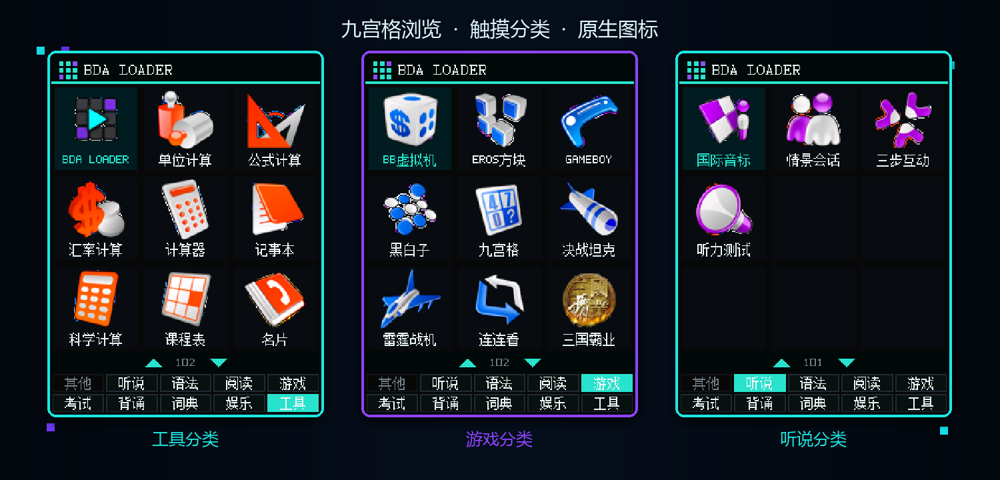

<p align="center">
  
</p>

<p align="center">
  <a href="https://github.com/HelloClyde/9588-bda-loader/actions/workflows/build-release.yml"></a>
  <a href="https://github.com/HelloClyde/9588-bda-loader/releases/latest"></a>
  <a href="LICENSE"></a>
  
</p>

**9588 BDA Loader** 是一个面向步步高 BBK 9588/9688 的原生 BDA 应用启动器。它会
扫描设备中的 BDA，读取标题、分类和原生图标，以黑色主题九宫格展示，并通过固件
自己的校验/加载流程启动目标应用。

项目不包含固件、系统字体、商业 BDA 或其他受版权保护的设备资源。
中文标题使用设备自带的 `A:\系统\数据\HZK_LIB.BIN`；缺少或无法读取时，Loader
会显示提示并安全退出。

## 界面预览



## 快速开始

### 直接安装

1. 从 [Releases](https://github.com/HelloClyde/9588-bda-loader/releases/latest)
   下载 `BdaLoader.bda`。
2. 将文件复制到设备的 `A:\应用\程序\`。使用 SD 卡整理文件时，这通常对应
   `应用\程序\` 目录。
3. 重新进入系统应用菜单，在“工具”分类中启动 **BDA Loader**。
4. 点击九宫格应用，或使用方向键选中后按 Enter，即可启动目标 BDA。

> 9588 JZ4720/JZ4740 和 9688 JZ4730/JZ4740 目前完成了对应固件的静态机器码验证；
> 首次真机验证建议先安装 `BdaLoaderDebug.bda`，退出后取回 `A:\BDALOAD.LOG`。

### 操作方式

| 操作 | 功能 |
|---|---|
| 触摸九宫格应用 | 启动对应 BDA |
| 触摸底部双行 tabs | 立即切换分类 |
| 触摸页码栏箭头 | 上一页 / 下一页 |
| 方向键 | 移动选择；越过边界时翻页 |
| Enter | 启动选中的 BDA |
| Esc | 退出 Loader，返回系统菜单 |

## 功能

- 自动扫描 `A:\应用\程序\*.bda`，忽略损坏或不符合固件规则的文件。
- 黑色主题 3×3 九宫格，每页 9 个应用，支持上下翻页。
- 底部两行双字分类 tabs：其他、听说、语法、阅读、游戏、考试、背诵、词典、娱乐、工具。
- 读取 BDA header 的标题、分类、54×54 普通图标和 58×58 选中图标。
- 运行时读取设备原生 12×12 GBK 字库，保持与系统菜单一致的中文字形。
- 支持固件 VX 资源及官方兼容 24 位 BMP 图标。
- 不使用标准窗口事件循环，采用原生 raw event + key packet 主循环，减少刷新延迟。
- 启动扫描期间显示 Loading 状态；支持实体 Esc 退出。
- 提供诊断版，记录扫描、header 读取、图标读取、输入和链式启动现场。
- 支持 9588 V3.30 的 JZ4720/JZ4730/JZ4740，以及 9688 V2.32 的
  JZ4730/JZ4740 path-loader 布局。

## 固件兼容性

| 机型 / 版本 | 芯片 | 固件文件 | 状态 | 链式启动 profile |
|---|---|---|---|---|
| 9588 V3.30 | JZ4720 | `4720knl.bin` / `C200_4720.bin` | 静态验证通过 | `ra-0x22c`，第三参数取 `s4` |
| 9588 V3.30 | JZ4730 | `C200knl.bin` / `C200.bin` | **真机验证通过** | `ra-0x1f4`，第三参数取 `s6` |
| 9588 V3.30 | JZ4740 | `kj409588.bin` / `C200.bin` | 静态验证通过 | `ra-0x1f4`，第三参数取 `s6` |
| 9688 V2.32 | JZ4730 | `C100knl.bin` / `C100.bin` | 静态验证通过 | `ra-0x1f4`，第三参数取 `s6` |
| 9688 V2.32 | JZ4740 | `kj409688.bin` / `C100.bin` | 静态验证通过 | `ra-0x1f4`，第三参数取 `s6` |

Loader 不会只凭固定地址判断固件。启动目标前会校验当前 path-loader 的 prologue、
参数保存、`0x81c00020` 装载目标、`jalr`、返回分支和 cache barrier。未知布局会拒绝
修改返回栈，而不是冒险跳转。

入口地址、调用 ABI、包装头说明和离线验证命令见
[固件兼容性文档](docs/firmware-compatibility.md)。

## 从源码构建

### 环境要求

- Python 3.10 或更高版本；
- MIPS little-endian GCC/binutils；
- Git；
- 可访问公开仓库
  [`bbk9588-bda-sdk`](https://github.com/HelloClyde/bbk9588-bda-sdk)。

Linux 可以安装发行版工具链：

```bash
sudo apt-get update
sudo apt-get install gcc-mipsel-linux-gnu binutils-mipsel-linux-gnu
```

### 构建步骤

```bash
git clone https://github.com/HelloClyde/9588-bda-loader.git
cd 9588-bda-loader

python -m venv .venv
# Linux/macOS:
source .venv/bin/activate
# Windows PowerShell:
# .\.venv\Scripts\Activate.ps1

python -m pip install -r requirements-build.txt

# 普通版
python build.py --prefix mipsel-linux-gnu-

# 诊断版
python build.py --diagnostic --prefix mipsel-linux-gnu-
```

Windows 上如果 `mipsel-none-elf-gcc` 已在 `PATH`，可以直接运行：

```powershell
.\build.ps1
.\build.ps1 -Diagnostic
```

输出文件位于：

```text
dist/BdaLoader.bda
dist/BdaLoaderDebug.bda
```

构建脚本会调用 `bda_packer` 进行 BDA header、入口、checksum 和四档图标校验。CI 使用
固定 SDK commit，确保构建结果可追溯。

## 关键实现

### 系统字体

Loader 不再内嵌第三方中文点阵。启动时会打开
`A:\系统\数据\HZK_LIB.BIN`，校验文件长度，并将固件 GBK 12×12 字模区一次读取到
堆缓存。页面绘制只访问内存，不会在翻页或切换分类时反复读取文件。

字库不存在、长度异常、读取失败或缓存内存不足时，会通过固件 MsgBox 说明原因并
安全返回系统菜单。字库缓存会在退出 Loader 或启动目标 BDA 前释放。

### 图标合成

BDA 图标中的 RGB565 `0xf81f` 是显式透明色键，而固件整屏 VX 提交还会把
`0x0000` 解释为“不覆盖目标像素”。Loader 在自己的整屏 VX 中逐像素合成：

- `0xf81f` 明确写入卡片背景；
- 非色键 `0x0000` 映射为肉眼近黑但会覆盖的 `0x0001`；
- 其他像素保持原色。

这样透明边缘不会泄露上一个坑位或旧 framebuffer 的内容。

### 安全链式启动

所有 BDA 都运行在固定入口 `0x81c00020`。Loader 不能在自己仍占用该地址时同步启动
另一个 BDA。当前实现会：

1. 校验正在执行的固件 path-loader profile；
2. 在任何日志、字库或 GUI 分配前，首先预留一段小型 MIPS trampoline；
3. 写入目标路径和指令后，先释放 Loader 的字体、图标与绘图资源；
4. 等待固定 8 个固件 tick，让普通版和诊断版具有相同的最短收尾时间；
5. 用固件 D-cache barrier 写回 trampoline，并把外层返回地址改为其 KSEG1 非缓存别名；
6. 让 Loader 正常返回并完成固件 post-BDA 收尾；
7. 再由 trampoline 从完整入口启动目标 BDA；
8. 目标返回后 tail-call `MEM_FREE`，释放 trampoline 并回到原菜单 continuation。

这避免目标覆盖仍在执行的 Loader，也消除了诊断日志、堆复用和 I-cache
状态对链式启动的影响；trampoline 会在目标返回后自行释放。

## 诊断日志

诊断版每次启动会重建 `A:\BDALOAD.LOG`，失败时回退到 `\BDALOAD.LOG`。链式启动前应
看到类似字段：

```text
BDALOAD TRACE V37
LAUNCH_BUFFER_PTR=...
SYSTEM_FONT=RUNTIME_HZK_LIB
SYSTEM_FONT_LOAD_RESULT=1
FIRMWARE_PROFILE=9588-JZ4730
LAUNCH_MODE=DEFER_AFTER_RETURN
LAUNCH_CACHE_BARRIER=...
DEFER_EXEC_MODE=KSEG1_UNCACHED
DEFER_PREPARED
DEFER_SETTLE_TICKS=8
DEFER_COMMIT_AND_RETURN
```

复现死机后请先重启并复制日志，不要再次运行诊断版，以免覆盖现场。

## CI 与发布

GitHub Actions 会在每次 push、Pull Request 和手动触发时：

1. 安装 MIPS 交叉编译工具链；
2. 安装固定版本的 BDA SDK/packer；
3. 构建普通版和诊断版；
4. 运行 BDA 格式校验；
5. 生成 `SHA256SUMS.txt` 并上传 CI artifact。

推送形如 `v1.0.0` 的 tag 时，同一 workflow 会将以下文件自动发布到 GitHub Release：

- `BdaLoader.bda`
- `BdaLoaderDebug.bda`
- `SHA256SUMS.txt`

## 项目结构

```text
.
├─ .github/workflows/       CI 与 tag Release
├─ assets/                  启动器图标
├─ docs/                    固件兼容性说明
├─ docs/images/             README 横幅和截图拼图
├─ docs/screenshots/        原始界面截图
├─ src/
│  ├─ bda_loader.c          主程序
│  └─ bda_loader_debug.c    诊断构建入口
├─ tools/                   固件 profile 验证工具
├─ build.py                 跨平台构建入口
└─ build.ps1                Windows PowerShell 包装
```

## 贡献与问题反馈

提交代码前请阅读 [CONTRIBUTING.md](CONTRIBUTING.md)。普通问题使用 GitHub Issues；
潜在安全问题请按 [SECURITY.md](SECURITY.md) 私下报告。

反馈兼容性问题时，请注明芯片型号、固件版本、BDA SHA256，并附上已脱敏的诊断日志。
请勿上传完整固件、商业应用或个人数据。

## 许可证

项目代码采用 [Apache License 2.0](LICENSE)，第三方构建依赖见
[THIRD_PARTY_NOTICES.md](THIRD_PARTY_NOTICES.md)。

README 顶部横幅底图由 **GPT-Image-2** 生成，项目标题和芯片型号使用本地确定性排版。
